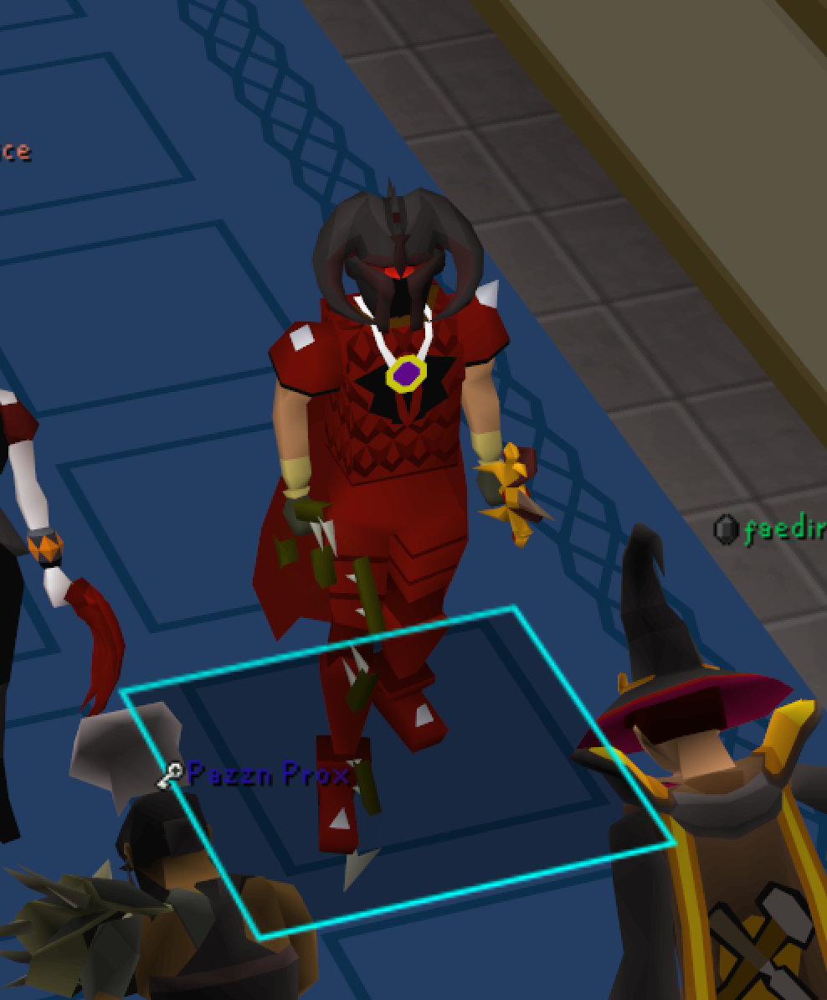
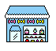

<!-- Header with subheading -->

  
   
  

 

<!-- info table -->
<table width="50%" align="center" >
  </thead>
  <tbody>
    <tr>
      <th width="10%">I make cool stuff</th>
      <th width="10%">I research applications of technology between disciplines</th>
    </tr>
    <tr>
      <td align="center">
          
      </td>
      <td align="center">
          
      </td>
    </tr>
    <tr>
      <th width="10%">I'm published</th>
      <th width="10%">I'm GM btw</th>
    </tr>
    <tr>
      <td align="center">
          
      </td>
      <td align="center">
           
      </td>
    </tr>
  </tbody>
</table>

<!-- footer -->

   
  
  

